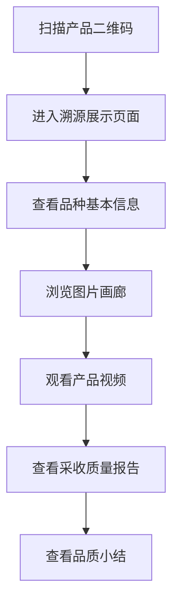
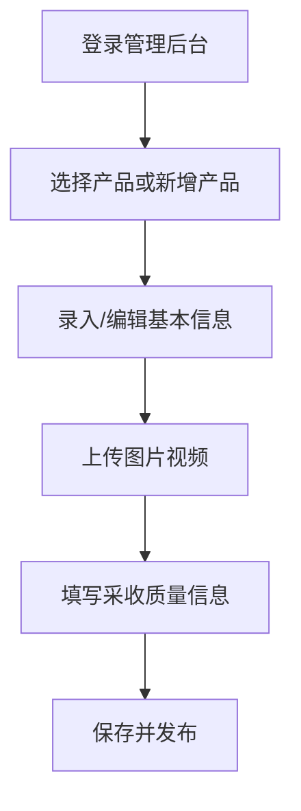

# 农产品溯源系统 PRD 文档

## 1. 产品概述

农产品溯源系统是一款面向普通消费者的移动端优先Web应用，旨在为农产品（以枣类为例）提供全生命周期的信息展示。消费者通过扫描产品二维码，可以查看产品的品种信息、种植环境媒体资料以及采收质量报告，增强对产品品质的信任度。

## 2. 核心功能

### 2.1 用户角色

| 角色 | 说明 | 核心权限 |
|------|------|----------|
| 消费者 | 扫描二维码查看产品溯源信息 | 查看溯源展示页面 |
| 管理员 | 管理产品信息和录入溯源数据 | 产品CRUD、媒体上传 |

### 2.2 功能模块

1. **消费者端（溯源展示）**
   - 产品基本信息展示
   - 图片画廊展示
   - 视频播放器
   - 采收质量报告
   - 品质小结

2. **管理端（后台管理）**
   - 产品列表管理
   - 产品信息录入/编辑
   - 图片视频上传管理
   - 采收质量信息管理

## 3. 核心流程

### 3.1 消费者溯源流程



### 3.2 管理员管理流程



## 4. 页面结构

### 4.1 消费者端页面

| 页面名称 | 模块组成 | 功能描述 |
|----------|----------|----------|
| 溯源首页 | 产品信息卡片 | 展示品种名、编码、定植地点、定植时间 |
| 媒体展示页 | 图片画廊、视频播放器 | 轮播展示产品图片，播放产品视频 |
| 质量报告页 | 采收信息表格、质量指标 | 展示糖度、重量、口感等质量数据 |
| 品质小结页 | 文字总结 | 产品品质综合评价和建议人群 |

### 4.2 管理端页面

| 页面名称 | 模块组成 | 功能描述 |
|----------|----------|----------|
| 登录页 | 账号密码表单 | 管理员登录验证 |
| 产品列表页 | 产品卡片列表 | 展示所有产品，支持搜索和筛选 |
| 产品编辑页 | 多步骤表单 | 基本信息、媒体上传、质量报告录入 |
| 媒体管理页 | 文件上传组件 | 支持多图上传、视频上传、预览和删除 |

## 5. UI设计规范

### 5.1 设计风格：清新自然风格

- **设计理念**：以「自然、健康、可追溯」为核心，营造纯净、可信赖的视觉体验
- **主色调**：森林绿 `#2D5A27` 象征自然生机
- **辅助色**：暖米色 `#F5F0E8` 传递温暖质感
- **强调色**：阳光橙 `#E8A838` 用于重要操作和提示
- **背景色**：纯净白 `#FFFFFF` 和浅灰 `#F8F9FA`
- **文字色**：深灰 `#333333` 主文字，灰色 `#666666` 次要文字

### 5.2 圆角设计

- **卡片圆角**：16px - 营造柔和感
- **按钮圆角**：12px - 友好可触
- **图片圆角**：12px - 与整体风格统一
- **输入框圆角**：8px - 精致细腻

### 5.3 阴影效果

- **卡片阴影**：`0 4px 20px rgba(45, 90, 39, 0.08)` - 轻盈自然
- **悬浮阴影**：`0 8px 30px rgba(45, 90, 39, 0.15)` - 层次分明
- **按钮阴影**：`0 4px 12px rgba(45, 90, 39, 0.2)` - 立体可触

### 5.4 字体规范

- **标题字体**：思源黑体 / Noto Sans SC（700字重）- 现代专业
- **正文字体**：思源黑体 / Noto Sans SC（400字重）- 清晰易读
- **数字字体**：DIN Alternate / Roboto Mono - 数据展示专业
- **字号层级**：
  - H1 标题：28px / 1.3行高
  - H2 副标题：22px / 1.4行高
  - 正文：16px / 1.6行高
  - 辅助文字：14px / 1.5行高
  - 标签文字：12px / 1.4行高

### 5.5 间距系统

- **基础单位**：8px
- **页面边距**：24px（移动端）/ 48px（桌面端）
- **卡片间距**：16px
- **模块间距**：32px
- **元素间距**：12px

### 5.6 动效设计

- **页面切换**：淡入淡出 300ms ease-out
- **卡片悬浮**：transform: translateY(-4px), 200ms ease
- **图片轮播**：滑动过渡 400ms ease-in-out
- **按钮点击**：scale(0.98), 100ms
- **数据加载**：骨架屏动画 1.5s infinite

### 5.7 图标风格

- 使用线性图标，2px描边
- 颜色跟随文字色或主题色
- 尺寸：24px（标准）、20px（辅助）、16px（紧凑）

## 6. 组件设计

### 6.1 产品信息卡片

- 左侧：品种图标或产品图片缩略图（80x80px，圆角12px）
- 右侧：品种名称（大号字体）、编码、种植信息
- 底部：时间线展示（定植时间 → 当前）
- 卡片整体：白色背景，16px圆角，轻阴影

### 6.2 图片画廊

- 网格布局：2列（移动端）/ 3列（桌面端）
- 图片比例：4:3
- 点击放大：全屏浏览，支持左右滑动
- 加载状态：骨架屏占位
- 圆角：12px

### 6.3 视频播放器

- 16:9 比例容器
- 圆角：16px
- 控制栏：播放/暂停、音量、全屏
- 封面图：视频未播放时显示
- 加载指示：中心圆形进度

### 6.4 质量指标卡片

- 网格布局：2列
- 每个指标：图标 + 数值 + 单位 + 标签
- 数值字体：DIN Alternate，大号加粗
- 卡片背景：浅绿色渐变

### 6.5 品质小结区块

- 引用样式卡片，带左侧主题色边条（4px）
- 文字内容：16px，1.8行高
- 底部：适应人群标签（胶囊形状）

## 7. 移动端优先设计

### 7.1 布局特点

- 单栏布局为主，内容垂直堆叠
- 底部固定导航栏（消费者端：首页/媒体/质量）
- 拇指操作区域集中在屏幕下半部分
- 触摸目标最小 44x44px

### 7.2 响应式断点

- 移动端：< 768px
- 平板端：768px - 1024px
- 桌面端：> 1024px

### 7.3 性能优化

- 图片懒加载
- 视频仅在WIFI下自动播放
- 骨架屏减少感知加载时间
- 代码分割，按需加载

## 8. 技术架构

### 8.1 后端技术栈

| 技术 | 说明 |
|------|------|
| Django 4.2 | Python Web 框架 |
| Django REST Framework | RESTful API 开发 |
| SQLite | 数据库（轻量、易部署） |
| SimpleJWT | JWT 认证 |
| django-cors-headers | CORS 跨域支持 |

### 8.2 前端技术栈

| 技术 | 说明 |
|------|------|
| Vue 3 + TypeScript | 核心框架 |
| Vite | 构建工具 |
| Vue Router | 路由管理 |
| Pinia | 状态管理 |
| Axios | HTTP 请求 |
| Element Plus | 管理端 UI 组件 |
| UnoCSS | 展示端原子化 CSS |

### 8.3 数据模型

#### 8.3.1 产品模型 (Product)

| 字段 | 类型 | 说明 |
|------|------|------|
| id | int | 主键 |
| name | string | 品种名称 |
| code | string | 品种编码（如 4395） |
| planting_location | string | 定植地点 |
| planting_date | date | 定植时间 |
| images | json | 产品图片URL数组 |
| video | url | 视频链接 |
| harvest_start_date | date | 采收起始时间 |
| harvest_end_date | date | 采收终止时间 |
| sugar_content | decimal | 糖度（Brix） |
| weight | decimal | 单果重量（克） |
| taste | string | 口感描述 |
| quality | string | 品质等级 |
| quality_summary | text | 品质小结 |
| suitable_for | json | 适应人群数组 |
| created_at | datetime | 创建时间 |
| updated_at | datetime | 更新时间 |

#### 8.3.2 媒体文件模型 (MediaFile)

| 字段 | 类型 | 说明 |
|------|------|------|
| id | int | 主键 |
| product_id | int | 关联产品ID |
| file | file | 文件对象 |
| media_type | string | 媒体类型（image/video） |
| filename | string | 文件名 |
| file_size | int | 文件大小 |
| uploaded_at | datetime | 上传时间 |

## 9. API接口设计

### 9.1 认证接口

| 方法 | 路径 | 说明 |
|------|------|------|
| POST | /api/v1/auth/login | 管理员登录 |
| POST | /api/v1/auth/refresh | 刷新Token |
| POST | /api/v1/auth/logout | 登出 |

### 9.2 产品接口

| 方法 | 路径 | 说明 | 认证 |
|------|------|------|------|
| GET | /api/v1/products | 获取产品列表 | 否 |
| GET | /api/v1/products/:id | 获取产品详情 | 否 |
| GET | /api/v1/products/public/code/:code | 通过编码获取(扫码用) | 否 |
| POST | /api/v1/products | 创建产品 | 是 |
| PUT | /api/v1/products/:id | 更新产品 | 是 |
| DELETE | /api/v1/products/:id | 删除产品 | 是 |

### 9.3 媒体接口

| 方法 | 路径 | 说明 | 认证 |
|------|------|------|------|
| POST | /api/v1/media/upload | 上传媒体文件 | 是 |
| DELETE | /api/v1/media/:id | 删除媒体 | 是 |

## 10. 示例数据

以「枣甜5号」为例：

```json
{
  "id": 1,
  "name": "枣甜5号",
  "code": "4395",
  "planting_location": "新疆和田洛浦县红枣基地",
  "planting_date": "2019-03-15",
  "images": [
    "https://example.com/media/images/zao1.jpg",
    "https://example.com/media/images/zao2.jpg",
    "https://example.com/media/images/zao3.jpg"
  ],
  "video": "https://example.com/media/videos/zao_intro.mp4",
  "harvest_start_date": "2023-09-20",
  "harvest_end_date": "2023-10-15",
  "sugar_content": 28.5,
  "weight": 12.8,
  "taste": "肉质紧密、甘甜爽口、核小肉厚",
  "quality": "特级",
  "quality_summary": "枣甜5号果实饱满，色泽红润，含糖量高，口感极佳。采用有机种植，无农药残留，是健康美味的优质干果。",
  "suitable_for": ["一般人群", "糖尿病患者慎食", "儿童", "老年人"]
}
```
