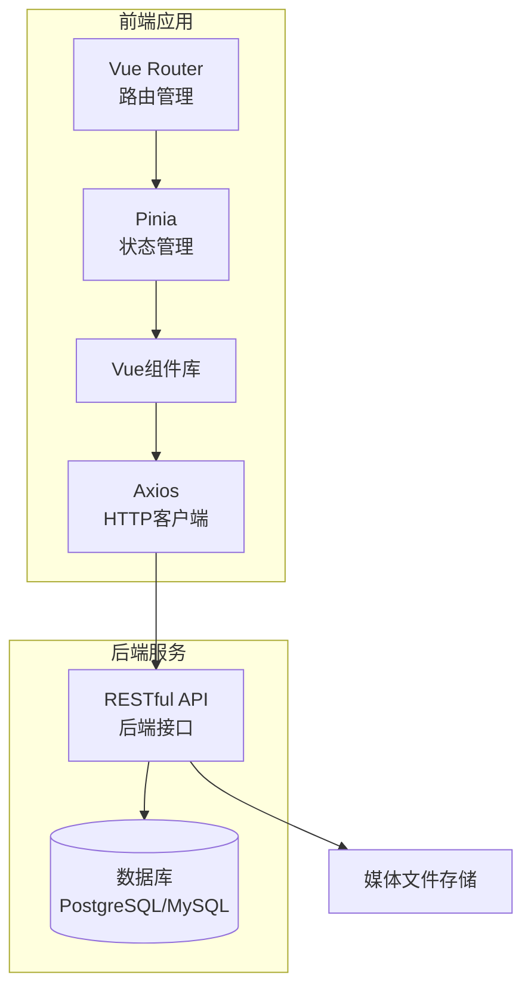

# 农产品溯源系统技术架构文档

## 1. 架构设计



## 2. 技术栈选型

### 2.1 前端技术栈

| 技术 | 版本 | 用途 |
|------|------|------|
| Vue 3 | ^3.4 | 核心框架，组合式API |
| TypeScript | ^5.3 | 类型安全开发 |
| Vite | ^5.0 | 现代化构建工具 |
| Vue Router | ^4.2 | 路由管理 |
| Pinia | ^2.1 | 状态管理 |
| Axios | ^1.6 | HTTP请求库 |
| Element Plus | ^2.5 | UI组件库（管理端） |
| UnoCSS | ^0.58 | 原子化CSS（展示端） |

### 2.2 项目结构

```
agriculture-traceability/
├── frontend/
│   ├── trace-web/              # 消费者端（移动端优先）
│   │   ├── src/
│   │   │   ├── views/         # 页面组件
│   │   │   │   ├── HomeView.vue
│   │   │   │   ├── MediaView.vue
│   │   │   │   └── QualityView.vue
│   │   │   ├── components/    # 公共组件
│   │   │   │   ├── ProductCard.vue
│   │   │   │   ├── ImageGallery.vue
│   │   │   │   ├── VideoPlayer.vue
│   │   │   │   └── QualityCard.vue
│   │   │   ├── composables/  # 组合式函数
│   │   │   ├── stores/       # Pinia状态
│   │   │   ├── api/          # API接口
│   │   │   ├── types/        # TypeScript类型
│   │   │   └── styles/        # 全局样式
│   │   └── index.html
│   │
│   ├── trace-admin/           # 管理端
│   │   ├── src/
│   │   │   ├── views/        # 页面组件
│   │   │   │   ├── LoginView.vue
│   │   │   │   ├── ProductListView.vue
│   │   │   │   └── ProductEditView.vue
│   │   │   ├── components/    # 公共组件
│   │   │   └── layouts/       # 布局组件
│   │   └── index.html
│   │
│   └── shared/               # 共享模块
│       ├── types/            # 共享类型定义
│       └── utils/            # 共享工具函数
│
├── backend/                   # 后端目录（暂不开发）
│   └── api/                   # API服务
│
└── docs/                      # 文档目录
```

## 3. 路由设计

### 3.1 消费者端路由

| 路径 | 页面名称 | 组件 | 说明 |
|------|----------|------|------|
| / | 首页 | HomeView | 产品溯源信息概览 |
| /media | 媒体展示 | MediaView | 图片画廊和视频播放 |
| /quality | 质量报告 | QualityView | 采收质量详细信息 |

### 3.2 管理端路由

| 路径 | 页面名称 | 组件 | 说明 |
|------|----------|------|------|
| /admin/login | 登录页 | LoginView | 管理员登录 |
| /admin | 产品列表 | ProductListView | 产品管理列表 |
| /admin/product/new | 新增产品 | ProductEditView | 创建新产品 |
| /admin/product/:id/edit | 编辑产品 | ProductEditView | 编辑产品信息 |

### 3.3 路由守卫

```typescript
// 路由守卫示例
const routes = [
  {
    path: '/admin',
    component: AdminLayout,
    children: adminRoutes,
    meta: { requiresAuth: true }
  }
]

router.beforeEach((to, from, next) => {
  const authStore = useAuthStore()
  if (to.meta.requiresAuth && !authStore.isAuthenticated) {
    next('/admin/login')
  } else {
    next()
  }
})
```

## 4. API接口设计

### 4.1 接口基础规范

- **Base URL**: `/api/v1`
- **数据格式**: JSON
- **认证方式**: JWT Token
- **编码**: UTF-8

### 4.2 接口列表

#### 4.2.1 产品接口

| 方法 | 路径 | 说明 | 请求体 | 响应 |
|------|------|------|--------|------|
| GET | /products | 获取产品列表 | - | ProductListResponse |
| GET | /products/:id | 获取产品详情 | - | ProductDetailResponse |
| POST | /products | 创建产品 | CreateProductDTO | Product |
| PUT | /products/:id | 更新产品 | UpdateProductDTO | Product |
| DELETE | /products/:id | 删除产品 | - | SuccessResponse |

#### 4.2.2 媒体接口

| 方法 | 路径 | 说明 | 请求体 | 响应 |
|------|------|------|--------|------|
| POST | /upload/image | 上传图片 | FormData | UploadResponse |
| POST | /upload/video | 上传视频 | FormData | UploadResponse |
| DELETE | /media/:id | 删除媒体 | - | SuccessResponse |

### 4.3 数据传输对象

```typescript
// 创建产品 DTO
interface CreateProductDTO {
  name: string;
  code: string;
  plantingLocation: string;
  plantingDate: string;
  harvestStartDate: string;
  harvestEndDate: string;
  sugarContent: number;
  weight: number;
  taste: string;
  quality: string;
  qualitySummary: string;
  suitableFor: string[];
  imageUrls: string[];
  videoUrl: string;
}

// 产品响应
interface ProductResponse {
  id: string;
  name: string;
  code: string;
  plantingLocation: string;
  plantingDate: string;
  images: string[];
  video: string;
  harvest: {
    startDate: string;
    endDate: string;
    sugarContent: number;
    weight: number;
    taste: string;
    quality: string;
  };
  qualitySummary: string;
  suitableFor: string[];
  createdAt: string;
  updatedAt: string;
}
```

## 5. 状态管理设计

### 5.1 Pinia Store 结构

```typescript
// stores/product.ts
export const useProductStore = defineStore('product', () => {
  const currentProduct = ref<Product | null>(null)
  const productList = ref<Product[]>([])
  const loading = ref(false)
  
  const fetchProduct = async (id: string) => {
    loading.value = true
    try {
      const { data } = await api.getProduct(id)
      currentProduct.value = data
    } finally {
      loading.value = false
    }
  }
  
  return { currentProduct, productList, loading, fetchProduct }
})

// stores/auth.ts
export const useAuthStore = defineStore('auth', () => {
  const token = ref(localStorage.getItem('token') || '')
  const isAuthenticated = computed(() => !!token.value)
  
  const login = async (credentials: LoginDTO) => {
    const { data } = await api.login(credentials)
    token.value = data.token
    localStorage.setItem('token', data.token)
  }
  
  return { token, isAuthenticated, login }
})
```

## 6. 组件库设计

### 6.1 消费者端组件

| 组件名 | 用途 | Props |
|--------|------|-------|
| ProductCard | 产品信息卡片 | product: Product |
| ImageGallery | 图片画廊组件 | images: string[] |
| ImagePreview | 图片预览弹窗 | visible, images, initialIndex |
| VideoPlayer | 视频播放器 | src: string, poster?: string |
| QualityCard | 质量指标卡片 | icon, value, unit, label |
| QualitySummary | 品质小结组件 | summary: string, suitableFor: string[] |
| TimelineBar | 时间线组件 | items: TimelineItem[] |
| LoadingSkeleton | 加载骨架屏 | type: 'card' \| 'image' \| 'text' |

### 6.2 管理端组件

| 组件名 | 用途 |
|--------|------|
| AdminLayout | 后台布局容器 |
| ProductForm | 产品编辑表单 |
| ImageUploader | 图片上传组件 |
| VideoUploader | 视频上传组件 |
| DataTable | 数据表格组件 |

## 7. 部署架构

### 7.1 构建配置

```typescript
// vite.config.ts (消费者端)
export default defineConfig({
  base: './',
  build: {
    outDir: 'dist/trace-web',
    assetsDir: 'assets',
    sourcemap: false,
    rollupOptions: {
      output: {
        manualChunks: {
          'element-plus': ['element-plus']
        }
      }
    }
  }
})
```

### 7.2 部署目录结构

```
/var/www/agriculture-traceability/
├── index.html              # 消费者端入口
├── admin/                  # 管理端静态文件
│   └── index.html
├── assets/                 # 静态资源
└── api/                    # 后端API代理（可选）
```

### 7.3 Nginx 配置示例

```nginx
server {
    listen 80;
    server_name trace.example.com;
    root /var/www/agriculture-traceability;
    index index.html;

    # 消费者端
    location / {
        try_files $uri $uri/ /index.html;
    }

    # 管理端
    location /admin {
        alias /var/www/agriculture-traceability/admin;
        try_files $uri $uri/ /admin/index.html;
    }

    # API 代理
    location /api {
        proxy_pass http://localhost:3000/api;
        proxy_set_header Host $host;
        proxy_set_header X-Real-IP $remote_addr;
    }

    # 静态资源缓存
    location ~* \.(js|css|png|jpg|jpeg|gif|ico|svg|woff|woff2)$ {
        expires 1y;
        add_header Cache-Control "public, immutable";
    }
}
```

## 8. 开发规范

### 8.1 代码规范

- 使用 ESLint + Prettier
- Vue 组件使用 `<script setup>` 语法
- TypeScript 严格模式
- CSS 使用 UnoCSS 原子类 + scoped 样式

### 8.2 Git 提交规范

```
feat: 新功能
fix: 修复bug
docs: 文档更新
style: 代码格式
refactor: 重构
test: 测试相关
chore: 构建/工具相关
```

### 8.3 环境变量

```bash
# .env.development
VITE_API_BASE_URL=http://localhost:3000/api

# .env.production
VITE_API_BASE_URL=https://api.example.com/api
```

## 9. 性能优化

### 9.1 前端优化

- 图片懒加载：使用 `loading="lazy"`
- 视频延迟加载：仅在视口内时加载
- 路由懒加载：动态导入页面组件
- 资源压缩：Vite 生产构建自动压缩

### 9.2 移动端优化

- Viewport 适配：`<meta name="viewport" content="width=device-width, initial-scale=1.0">`
- 触摸优化：300ms 点击延迟移除
- 视网膜屏：使用 2x 图片资源

## 10. 安全考虑

### 10.1 前端安全

- XSS 防护：Vue 自动转义
- CSRF：使用 SameSite Cookie
- 敏感信息：存储在内存而非 localStorage

### 10.2 媒体上传

- 文件类型验证：仅允许 jpg, png, mp4, webm
- 文件大小限制：图片 < 5MB，视频 < 100MB
- 上传进度：显示上传进度条
