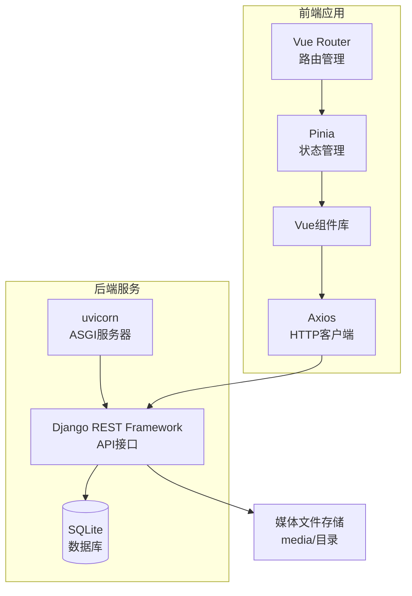
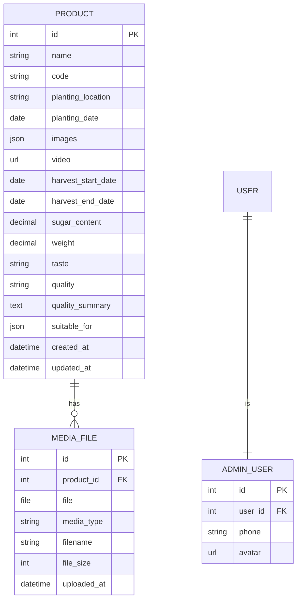

# 农产品溯源系统技术架构文档

## 1. 架构设计



## 2. 技术栈选型

### 2.1 前端技术栈

| 技术 | 版本 | 用途 |
|------|------|------|
| Vue 3 | ^3.4 | 核心框架，组合式API |
| TypeScript | ^5.3 | 类型安全开发 |
| Vite | ^5.0 | 现代化构建工具 |
| Vue Router | ^4.2 | 路由管理 |
| Pinia | ^2.1 | 状态管理 |
| Axios | ^1.6 | HTTP请求库 |
| Element Plus | ^2.5 | UI组件库（管理端） |
| UnoCSS | ^0.58 | 原子化CSS（展示端） |

### 2.2 后端技术栈

| 技术 | 版本 | 用途 |
|------|------|------|
| Python | ^3.10 | 运行环境 |
| Django | ^4.2 | Web框架 |
| Django REST Framework | ^3.14 | RESTful API开发 |
| djangorestframework-simplejwt | ^5.3 | JWT认证 |
| Pillow | ^10.0 | 图片处理 |
| django-cors-headers | ^4.3 | CORS跨域支持 |

### 2.3 项目结构

```
agriculture-traceability/
├── frontend/                      # Vue前端项目
│   ├── trace-web/                 # 消费者端（移动端优先）
│   │   ├── src/
│   │   │   ├── views/            # 页面组件
│   │   │   ├── components/       # 公共组件
│   │   │   ├── composables/      # 组合式函数
│   │   │   ├── stores/           # Pinia状态
│   │   │   ├── api/             # API接口
│   │   │   ├── types/           # TypeScript类型
│   │   │   └── styles/          # 全局样式
│   │   └── index.html
│   │
│   ├── trace-admin/              # 管理端
│   │   └── ...
│   │
│   └── package.json
│
├── backend/                      # Django后端项目
│   ├── trace_api/                # Django项目配置
│   │   ├── settings.py
│   │   ├── urls.py
│   │   └── wsgi.py
│   │
│   ├── products/                 # 产品应用
│   │   ├── models.py            # 数据模型
│   │   ├── serializers.py       # 序列化器
│   │   ├── views.py             # 视图集
│   │   └── urls.py              # 路由
│   │
│   ├── media/                   # 媒体文件存储目录
│   │   ├── images/
│   │   └── videos/
│   │
│   ├── manage.py
│   └── requirements.txt
│
└── docs/                         # 文档目录
```

## 3. 后端数据模型

### 3.1 Django Model 设计

```python
# products/models.py

from django.db import models
from django.contrib.auth.models import User


class Product(models.Model):
    """产品模型"""
    name = models.CharField('品种名称', max_length=100)
    code = models.CharField('品种编码', max_length=50, unique=True)
    planting_location = models.CharField('定植地点', max_length=200)
    planting_date = models.DateField('定植时间')
    images = models.JSONField('产品图片', default=list, blank=True)
    video = models.URLField('视频链接', blank=True, null=True)
    
    # 采收信息
    harvest_start_date = models.DateField('采收起始时间', blank=True, null=True)
    harvest_end_date = models.DateField('采收终止时间', blank=True, null=True)
    sugar_content = models.DecimalField('糖度', max_digits=4, decimal_places=2, null=True, blank=True)
    weight = models.DecimalField('单果重量(克)', max_digits=6, decimal_places=2, null=True, blank=True)
    taste = models.CharField('口感描述', max_length=200, blank=True)
    quality = models.CharField('品质等级', max_length=50, blank=True)
    
    # 品质小结
    quality_summary = models.TextField('品质小结', blank=True)
    suitable_for = models.JSONField('适应人群', default=list, blank=True)
    
    created_at = models.DateTimeField('创建时间', auto_now_add=True)
    updated_at = models.DateTimeField('更新时间', auto_now=True)
    
    class Meta:
        db_table = 'products'
        ordering = ['-created_at']
        verbose_name = '产品'
        verbose_name_plural = '产品列表'
    
    def __str__(self):
        return f"{self.name} ({self.code})"


class MediaFile(models.Model):
    """媒体文件模型"""
    MEDIA_TYPES = [
        ('image', '图片'),
        ('video', '视频'),
    ]
    
    product = models.ForeignKey(Product, on_delete=models.CASCADE, related_name='media_files')
    file = models.FileField('文件', upload_to='media/%Y/%m/')
    media_type = models.CharField('媒体类型', max_length=10, choices=MEDIA_TYPES)
    filename = models.CharField('文件名', max_length=255)
    file_size = models.IntegerField('文件大小(字节)', default=0)
    
    uploaded_at = models.DateTimeField('上传时间', auto_now_add=True)
    
    class Meta:
        db_table = 'media_files'
        ordering = ['-uploaded_at']
        verbose_name = '媒体文件'
        verbose_name_plural = '媒体文件列表'
    
    def __str__(self):
        return f"{self.product.name} - {self.filename}"


class AdminUser(models.Model):
    """管理员用户模型"""
    user = models.OneToOneField(User, on_delete=models.CASCADE)
    phone = models.CharField('手机号', max_length=20, blank=True)
    avatar = models.URLField('头像', blank=True)
    
    class Meta:
        db_table = 'admin_users'
        verbose_name = '管理员'
        verbose_name_plural = '管理员列表'
```

### 3.2 数据库ER图



## 4. API接口设计

### 4.1 接口基础规范

- **Base URL**: `http://api.example.com/api/v1`
- **数据格式**: JSON
- **认证方式**: JWT Token (通过 SimpleJWT)
- **编码**: UTF-8
- **跨域**: CORS配置允许前端域名

### 4.2 接口列表

#### 4.2.1 认证接口

| 方法 | 路径 | 说明 | 请求体 | 响应 |
|------|------|------|--------|------|
| POST | /auth/login | 管理员登录 | `{username, password}` | `{access, refresh}` |
| POST | /auth/refresh | 刷新Token | `{refresh}` | `{access}` |
| POST | /auth/logout | 登出 | `{refresh}` | `{detail}` |

#### 4.2.2 产品接口

| 方法 | 路径 | 说明 | 认证 | 响应 |
|------|------|------|------|------|
| GET | /products | 获取产品列表 | 否 | ProductListResponse |
| GET | /products/:id | 获取产品详情 | 否 | ProductDetailResponse |
| POST | /products | 创建产品 | 是 | Product |
| PUT | /products/:id | 更新产品 | 是 | Product |
| DELETE | /products/:id | 删除产品 | 是 | SuccessResponse |
| GET | /products/public/:code | 通过编码获取(扫码用) | 否 | Product |

#### 4.2.3 媒体接口

| 方法 | 路径 | 说明 | 认证 | 请求体 |
|------|------|------|------|--------|
| POST | /media/upload | 上传媒体文件 | 是 | FormData |
| DELETE | /media/:id | 删除媒体 | 是 | SuccessResponse |

### 4.3 序列化器定义

```python
# products/serializers.py

from rest_framework import serializers
from .models import Product, MediaFile


class MediaFileSerializer(serializers.ModelSerializer):
    """媒体文件序列化器"""
    url = serializers.SerializerMethodField()
    
    class Meta:
        model = MediaFile
        fields = ['id', 'url', 'media_type', 'filename', 'file_size', 'uploaded_at']
    
    def get_url(self, obj):
        request = self.context.get('request')
        if obj.file and request:
            return request.build_absolute_uri(obj.file.url)
        return None


class ProductListSerializer(serializers.ModelSerializer):
    """产品列表序列化器(简洁)"""
    class Meta:
        model = Product
        fields = ['id', 'name', 'code', 'planting_location', 'planting_date', 'images', 'video']


class ProductDetailSerializer(serializers.ModelSerializer):
    """产品详情序列化器(完整)"""
    media_files = MediaFileSerializer(many=True, read_only=True)
    
    class Meta:
        model = Product
        fields = [
            'id', 'name', 'code', 'planting_location', 'planting_date',
            'images', 'video', 'media_files',
            'harvest_start_date', 'harvest_end_date', 'sugar_content',
            'weight', 'taste', 'quality', 'quality_summary', 'suitable_for',
            'created_at', 'updated_at'
        ]


class ProductCreateSerializer(serializers.ModelSerializer):
    """创建产品序列化器"""
    class Meta:
        model = Product
        fields = [
            'name', 'code', 'planting_location', 'planting_date',
            'images', 'video', 'harvest_start_date', 'harvest_end_date',
            'sugar_content', 'weight', 'taste', 'quality',
            'quality_summary', 'suitable_for'
        ]
    
    def validate_code(self, value):
        if Product.objects.filter(code=value).exists():
            raise serializers.ValidationError("该品种编码已存在")
        return value
```

### 4.4 视图集定义

```python
# products/views.py

from rest_framework import viewsets, status
from rest_framework.decorators import action
from rest_framework.response import Response
from rest_framework.permissions import AllowAny, IsAuthenticated
from django_filters.rest_framework import DjangoFilterBackend

from .models import Product, MediaFile
from .serializers import (
    ProductListSerializer, ProductDetailSerializer,
    ProductCreateSerializer, MediaFileSerializer
)


class ProductViewSet(viewsets.ModelViewSet):
    """产品视图集"""
    queryset = Product.objects.all()
    filter_backends = [DjangoFilterBackend]
    filterset_fields = ['code', 'name']
    
    def get_serializer_class(self):
        if self.action == 'list':
            return ProductListSerializer
        elif self.action in ['create', 'update', 'partial_update']:
            return ProductCreateSerializer
        return ProductDetailSerializer
    
    def get_permissions(self):
        if self.action in ['list', 'retrieve', 'public_by_code']:
            return [AllowAny()]
        return [IsAuthenticated()]
    
    @action(detail=False, methods=['get'], url_path='public/code/(?P<code>[^/.]+)')
    def public_by_code(self, request, code=None):
        """通过品种编码公开获取产品信息(用于二维码扫描)"""
        try:
            product = Product.objects.get(code=code)
            serializer = ProductDetailSerializer(product, context={'request': request})
            return Response(serializer.data)
        except Product.DoesNotExist:
            return Response(
                {'error': '产品不存在'},
                status=status.HTTP_404_NOT_FOUND
            )


class MediaFileViewSet(viewsets.ModelViewSet):
    """媒体文件视图集"""
    queryset = MediaFile.objects.all()
    serializer_class = MediaFileSerializer
    permission_classes = [IsAuthenticated]
    
    def perform_create(self, serializer):
        serializer.save()
    
    def create(self, request, *args, **kwargs):
        file = request.FILES.get('file')
        if not file:
            return Response(
                {'error': '未上传文件'},
                status=status.HTTP_400_BAD_REQUEST
            )
        
        # 判断文件类型
        media_type = 'image' if file.content_type.startswith('image') else 'video'
        
        product_id = request.data.get('product_id')
        if not product_id:
            return Response(
                {'error': '缺少产品ID'},
                status=status.HTTP_400_BAD_REQUEST
            )
        
        try:
            product = Product.objects.get(id=product_id)
        except Product.DoesNotExist:
            return Response(
                {'error': '产品不存在'},
                status=status.HTTP_404_NOT_FOUND
            )
        
        media = MediaFile.objects.create(
            product=product,
            file=file,
            media_type=media_type,
            filename=file.name,
            file_size=file.size
        )
        
        serializer = self.get_serializer(media)
        return Response(serializer.data, status=status.HTTP_201_CREATED)
```

### 4.5 Django URL 配置

```python
# trace_api/urls.py

from django.urls import path, include
from rest_framework.routers import DefaultRouter
from products.views import ProductViewSet, MediaFileViewSet

router = DefaultRouter()
router.register(r'products', ProductViewSet, basename='product')
router.register(r'media', MediaFileViewSet, basename='media')

urlpatterns = [
    path('api/v1/', include(router.urls)),
    path('api/v1/auth/', include('rest_framework_simplejwt.urls')),
]
```

## 5. 前端路由设计

### 5.1 消费者端路由

| 路径 | 页面名称 | 组件 | 说明 |
|------|----------|------|------|
| / | 首页 | HomeView | 产品溯源信息概览 |
| /media | 媒体展示 | MediaView | 图片画廊和视频播放 |
| /quality | 质量报告 | QualityView | 采收质量详细信息 |
| /p/:code | 扫码入口 | TraceView | 通过产品编码加载 |

### 5.2 管理端路由

| 路径 | 页面名称 | 组件 | 说明 |
|------|----------|------|------|
| /admin/login | 登录页 | LoginView | 管理员登录 |
| /admin | 产品列表 | ProductListView | 产品管理列表 |
| /admin/product/new | 新增产品 | ProductEditView | 创建新产品 |
| /admin/product/:id/edit | 编辑产品 | ProductEditView | 编辑产品信息 |

## 6. 状态管理设计

### 6.1 Pinia Store 结构

```typescript
// stores/product.ts
import { defineStore } from 'pinia'
import { ref } from 'vue'
import { productApi } from '@/api'

export const useProductStore = defineStore('product', () => {
  const currentProduct = ref<Product | null>(null)
  const productList = ref<Product[]>([])
  const loading = ref(false)
  
  const fetchProduct = async (id: string) => {
    loading.value = true
    try {
      const { data } = await productApi.getProduct(id)
      currentProduct.value = data
    } finally {
      loading.value = false
    }
  }
  
  const fetchByCode = async (code: string) => {
    loading.value = true
    try {
      const { data } = await productApi.getByCode(code)
      currentProduct.value = data
    } finally {
      loading.value = false
    }
  }
  
  return { currentProduct, productList, loading, fetchProduct, fetchByCode }
})

// stores/auth.ts
import { defineStore } from 'pinia'
import { ref, computed } from 'vue'
import { authApi } from '@/api'

export const useAuthStore = defineStore('auth', () => {
  const token = ref(localStorage.getItem('access_token') || '')
  const refreshToken = ref(localStorage.getItem('refresh_token') || '')
  const isAuthenticated = computed(() => !!token.value)
  
  const login = async (username: string, password: string) => {
    const { data } = await authApi.login({ username, password })
    token.value = data.access
    refreshToken.value = data.refresh
    localStorage.setItem('access_token', data.access)
    localStorage.setItem('refresh_token', data.refresh)
  }
  
  const logout = () => {
    token.value = ''
    refreshToken.value = ''
    localStorage.removeItem('access_token')
    localStorage.removeItem('refresh_token')
  }
  
  return { token, refreshToken, isAuthenticated, login, logout }
})
```

## 7. 组件库设计

### 7.1 消费者端组件

| 组件名 | 用途 | Props |
|--------|------|-------|
| ProductCard | 产品信息卡片 | product: Product |
| ImageGallery | 图片画廊组件 | images: string[] |
| ImagePreview | 图片预览弹窗 | visible, images, initialIndex |
| VideoPlayer | 视频播放器 | src: string, poster?: string |
| QualityCard | 质量指标卡片 | icon, value, unit, label |
| QualitySummary | 品质小结组件 | summary: string, suitableFor: string[] |
| TimelineBar | 时间线组件 | items: TimelineItem[] |
| LoadingSkeleton | 加载骨架屏 | type: 'card' \| 'image' \| 'text' |

### 7.2 管理端组件

| 组件名 | 用途 |
|--------|------|
| AdminLayout | 后台布局容器 |
| ProductForm | 产品编辑表单 |
| ImageUploader | 图片上传组件 |
| VideoUploader | 视频上传组件 |
| DataTable | 数据表格组件 |

## 8. 部署架构

### 8.1 后端部署

#### 8.1.1 环境要求

- Python 3.10+
- SQLite 3 (Django默认，无需额外安装)
- Nginx (静态文件服务和反向代理)
- Gunicorn / Uvicorn (WSGI/ASGI服务器)

#### 8.1.2 环境变量配置

```bash
# .env
DEBUG=False
SECRET_KEY=your-secret-key-here
ALLOWED_HOSTS=api.example.com
CORS_ALLOWED_ORIGINS=http://trace.example.com,http://localhost:5173
```

#### 8.1.3 启动命令

```bash
# 开发环境
cd backend
pip install -r requirements.txt
python manage.py migrate
python manage.py runserver 0.0.0.0:8000

# 生产环境
pip install -r requirements.txt
python manage.py migrate
gunicorn trace_api.wsgi:application --bind 0.0.0.0:8000 --workers 4
```

### 8.2 前端部署

```bash
# 构建消费者端
cd frontend/trace-web
npm install
npm run build

# 构建管理端
cd frontend/trace-admin
npm install
npm run build
```

### 8.3 Nginx 配置

```nginx
# /etc/nginx/sites-available/agriculture-traceability

# 消费者端
server {
    listen 80;
    server_name trace.example.com;
    root /var/www/agriculture-traceability/trace-web/dist;
    index index.html;

    location / {
        try_files $uri $uri/ /index.html;
    }

    location /api {
        proxy_pass http://127.0.0.1:8000;
        proxy_set_header Host $host;
        proxy_set_header X-Real-IP $remote_addr;
        proxy_set_header X-Forwarded-For $proxy_add_x_forwarded_for;
    }
}

# 管理端
server {
    listen 80;
    server_name admin.trace.example.com;
    root /var/www/agriculture-traceability/trace-admin/dist;
    index index.html;

    location / {
        try_files $uri $uri/ /index.html;
    }

    location /api {
        proxy_pass http://127.0.0.1:8000;
        proxy_set_header Host $host;
        proxy_set_header X-Real-IP $remote_addr;
    }
}

# 后端API服务
server {
    listen 8000;
    server_name api.example.com;
    
    location /media/ {
        alias /var/www/agriculture-traceability/backend/media/;
        expires 30d;
    }
    
    location / {
        proxy_pass http://127.0.0.1:8000;
        proxy_set_header Host $host;
        proxy_set_header X-Real-IP $remote_addr;
    }
}
```

### 8.4 部署目录结构

```
/var/www/agriculture-traceability/
├── frontend/
│   ├── trace-web/dist/         # 消费者端构建产物
│   └── trace-admin/dist/      # 管理端构建产物
│
└── backend/
    ├── media/                  # 媒体文件存储
    │   ├── images/
    │   └── videos/
    ├── db.sqlite3              # SQLite数据库文件
    └── static/                 # Django静态文件
```

## 9. 开发规范

### 9.1 Python代码规范

- 遵循 PEP 8
- 使用 Black 格式化
- 使用 flake8 检查
- 类型提示 (type hints)

### 9.2 Vue代码规范

- 使用 ESLint + Prettier
- Vue 组件使用 `<script setup>` 语法
- TypeScript 严格模式
- CSS 使用 UnoCSS 原子类 + scoped 样式

### 9.3 Git 提交规范

```
feat: 新功能
fix: 修复bug
docs: 文档更新
style: 代码格式
refactor: 重构
test: 测试相关
chore: 构建/工具相关
```

### 9.4 环境变量

```bash
# .env.development (前端)
VITE_API_BASE_URL=http://localhost:8000/api/v1

# .env.production (前端)
VITE_API_BASE_URL=https://api.example.com/api/v1
```

## 10. SQLite 数据迁移

```bash
# 创建迁移文件
python manage.py makemigrations

# 执行迁移
python manage.py migrate

# 创建超级管理员
python manage.py createsuperuser

# 数据导入(可选)
python manage.py loaddata initial_data.json
```

## 11. 安全考虑

### 11.1 后端安全

- CORS 配置限制允许的域名
- JWT Token 认证
- Django CSRF 防护
- SQL 注入防护 (ORM自动处理)
- 文件上传类型和大小限制

### 11.2 前端安全

- XSS 防护：Vue 自动转义
- Token 存储在 localStorage (JWT)
- API 请求自动携带 Token

### 11.3 媒体上传

- 文件类型验证：仅允许 jpg, png, gif, mp4, webm
- 文件大小限制：图片 < 5MB，视频 < 100MB
- 上传进度：显示上传进度条
- 文件名随机化避免冲突
