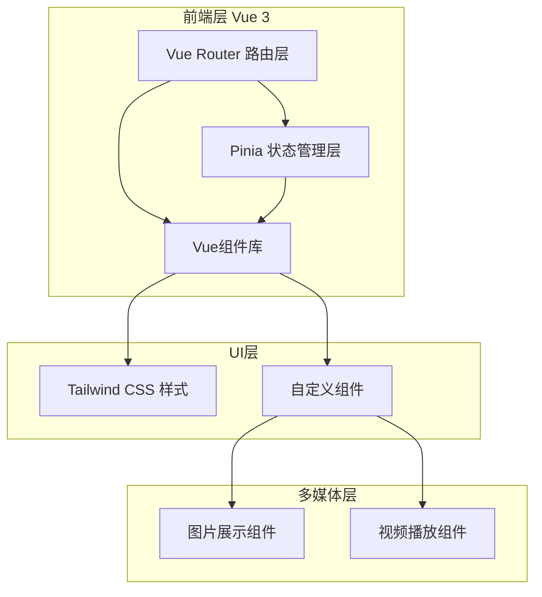
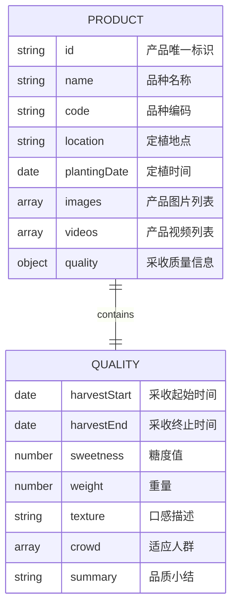

# 农产品溯源系统 - 技术架构文档

## 1. 系统架构设计

**前端架构图（Mermaid）：**


**技术栈总览：**
- 前端框架：Vue 3.4+ (Composition API)
- 构建工具：Vite 5.0
- 路由管理：Vue Router 4.0
- 状态管理：Pinia 2.1
- CSS框架：Tailwind CSS 3.4
- 多媒体：原生video + 自定义组件

## 2. 项目结构设计

```
src/
├── assets/                 # 静态资源
│   ├── images/            # 产品图片
│   └── videos/            # 产品视频
├── components/            # 公共组件
│   ├── common/            # 通用组件
│   │   ├── BaseCard.vue       # 基础卡片
│   │   ├── BaseBadge.vue      # 标签组件
│   │   ├── BaseButton.vue     # 按钮组件
│   │   └── BaseImage.vue      # 图片组件
│   ├── media/             # 媒体组件
│   │   ├── ImageGallery.vue    # 图片画廊
│   │   ├── VideoPlayer.vue    # 视频播放器
│   │   └── MediaPreview.vue   # 媒体预览
│   └── info/              # 信息展示组件
│       ├── ProductInfo.vue     # 产品信息
│       ├── QualityCard.vue     # 质量数据卡片
│       └── QualitySummary.vue  # 品质小结
├── views/                 # 页面视图
│   └── ProductDetail.vue  # 产品详情页
├── router/                # 路由配置
│   └── index.js
├── stores/                # Pinia状态管理
│   └── product.js         # 产品数据store
├── data/                  # 模拟数据
│   └── productData.js     # 产品静态数据
├── styles/                # 全局样式
│   └── main.css           # Tailwind入口
├── App.vue                # 根组件
└── main.js                # 应用入口
```

## 3. 路由定义

| 路由路径 | 组件 | 路由参数 | 功能描述 |
|---------|------|---------|---------|
| `/` | ProductDetail.vue | - | 默认展示"枣甜5号"产品 |
| `/product/:id` | ProductDetail.vue | id: 产品ID | 动态加载指定产品 |

**路由配置示例：**
```javascript
const routes = [
  {
    path: '/',
    name: 'Home',
    component: () => import('@/views/ProductDetail.vue')
  },
  {
    path: '/product/:id',
    name: 'ProductDetail',
    component: () => import('@/views/ProductDetail.vue'),
    props: true
  }
]
```

## 4. 数据模型定义

**产品数据模型（Mermaid ER图）：**


**TypeScript类型定义：**
```typescript
interface Product {
  id: string;
  name: string;
  code: string;
  location: string;
  plantingDate: string;
  images: MediaItem[];
  videos: MediaItem[];
  quality: QualityInfo;
}

interface MediaItem {
  id: string;
  url: string;
  type: 'image' | 'video';
  thumbnail?: string;
  alt?: string;
}

interface QualityInfo {
  harvestStart: string;
  harvestEnd: string;
  sweetness: number;
  weight: number;
  texture: string;
  crowd: string[];
  summary: string;
}
```

## 5. API接口定义（Mock）

**获取产品详情**
```typescript
// GET /api/product/:id
// Response:
{
  "code": 200,
  "data": {
    "id": "4395",
    "name": "枣甜5号",
    "code": "4395",
    "location": "新疆维吾尔自治区和田地区",
    "plantingDate": "2024-03-15",
    "images": [...],
    "videos": [...],
    "quality": {...}
  }
}
```

## 6. 组件清单

### 6.1 基础组件

| 组件名 | 用途 | Props | 主要样式 |
|--------|------|-------|---------|
| BaseCard | 信息卡片容器 | title, padding, shadow | 白色背景, 16px圆角, 阴影 |
| BaseBadge | 标签徽章 | text, color, size | 胶囊形状, 8px圆角 |
| BaseButton | 按钮组件 | type, size, disabled | 圆角按钮, hover效果 |
| BaseImage | 图片组件 | src, alt, lazy | 圆角16px, 懒加载 |

### 6.2 媒体组件

| 组件名 | 用途 | Props | 功能特性 |
|--------|------|-------|---------|
| ImageGallery | 图片画廊 | images[], columns | 网格布局, 点击放大 |
| VideoPlayer | 视频播放器 | src, poster | 自定义控制栏, 响应式 |
| MediaPreview | 媒体预览 | type, src | 灯箱效果, 关闭按钮 |

### 6.3 信息展示组件

| 组件名 | 用途 | Props | 展示内容 |
|--------|------|-------|---------|
| ProductInfo | 产品基础信息 | product | 品种、编码、地点、时间 |
| QualityCard | 质量数据卡片 | label, value, unit | 数字突出, 标签说明 |
| QualitySummary | 品质小结 | summary, author | 引用样式, 左竖线 |

## 7. 状态管理（Pinia Store）

**产品Store结构：**
```javascript
// stores/product.js
export const useProductStore = defineStore('product', {
  state: () => ({
    currentProduct: null,
    loading: false,
    error: null
  }),
  
  getters: {
    productName: (state) => state.currentProduct?.name,
    qualityData: (state) => state.currentProduct?.quality
  },
  
  actions: {
    async fetchProduct(id) {
      this.loading = true;
      try {
        const data = await fetchProductAPI(id);
        this.currentProduct = data;
      } catch (error) {
        this.error = error;
      } finally {
        this.loading = false;
      }
    }
  }
})
```

## 8. 样式架构

**Tailwind CSS配置要点：**

```javascript
// tailwind.config.js
module.exports = {
  content: ['./index.html', './src/**/*.{vue,js}'],
  theme: {
    extend: {
      colors: {
        primary: '#4A7C59',    // 森林绿
        secondary: '#F5E6D3',  // 暖米色
        accent: '#E8A838',     // 丰收金
        neutral: '#2D3436'     // 深灰
      },
      fontFamily: {
        serif: ['Noto Serif SC', 'serif'],
        sans: ['Noto Sans SC', 'sans-serif']
      },
      borderRadius: {
        'card': '16px',
        'badge': '9999px'
      },
      boxShadow: {
        'card': '0 4px 16px rgba(0,0,0,0.12)',
        'card-hover': '0 8px 32px rgba(0,0,0,0.16)'
      }
    }
  }
}
```

**关键CSS变量：**
```css
:root {
  --color-primary: #4A7C59;
  --color-secondary: #F5E6D3;
  --color-accent: #E8A838;
  --color-neutral: #2D3436;
  --radius-card: 16px;
  --radius-badge: 9999px;
  --shadow-card: 0 4px 16px rgba(0,0,0,0.12);
  --transition-default: all 0.3s ease;
}
```

## 9. 性能优化策略

**图片优化：**
- 启用懒加载（Intersection Observer）
- WebP格式支持
- 响应式图片srcset
- 图片占位符骨架屏

**视频优化：**
- 视频海报图片
- 延迟加载视频
- 视频格式：MP4(H.264)

**代码优化：**
- 路由懒加载
- 组件按需引入
- Tree-shaking优化
- CSS动画GPU加速

## 10. 开发环境配置

**Vite配置要点：**
```javascript
// vite.config.js
export default defineConfig({
  plugins: [vue()],
  resolve: {
    alias: {
      '@': '/src'
    }
  },
  server: {
    port: 5173,
    open: true
  }
})
```

**依赖清单（package.json）：**
```json
{
  "dependencies": {
    "vue": "^3.4.0",
    "vue-router": "^4.0.0",
    "pinia": "^2.1.0"
  },
  "devDependencies": {
    "@vitejs/plugin-vue": "^5.0.0",
    "vite": "^5.0.0",
    "tailwindcss": "^3.4.0",
    "autoprefixer": "^10.4.0",
    "postcss": "^8.4.0"
  }
}
```

## 11. 浏览器兼容性

**目标浏览器：**
- Chrome/Edge 90+
- Firefox 90+
- Safari 14+
- iOS Safari 14+
- Android Chrome 90+

**兼容性策略：**
- 使用CSS新特性时添加前缀
- video标签使用H.264编码
- 渐进增强，优雅降级

## 12. 部署架构

**静态部署方案：**
```
dist/
├── index.html
├── assets/
│   ├── js/
│   ├── css/
│   ├── images/
│   └── videos/
```

**推荐部署平台：**
- Vercel
- Netlify
- 阿里云OSS
- 腾讯云COS

**构建命令：**
```bash
npm run build    # 生产构建
npm run preview  # 本地预览构建结果
```
